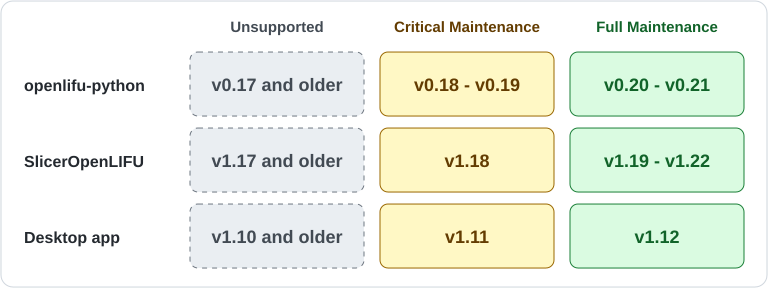

# Support schedule

This document defines the maintenance and support policy for `openlifu-desktop-application`.

## Release lines and patch releases

A **release line** is a `MAJOR.MINOR` version series, such as `1.12`.
Maintenance is delivered through patch releases. Only the **latest patch
release** within a supported line is supported; earlier patches are superseded.

## Maintenance tiers

- **Full Maintenance:** fixes for critical and noncritical issues.
- **Critical Maintenance:** fixes for critical issues only.
- **Unsupported:** no maintenance releases.

The latest desktop application release line receives Full Maintenance. The
immediately preceding release line receives Critical Maintenance. All older
release lines are unsupported.

With roughly two desktop release lines per year, each line receives approximately six
months of Full Maintenance followed by six months of Critical Maintenance.
Critical fixes are therefore covered for approximately one year in total.
Support transitions follow actual releases; these durations are not fixed
calendar deadlines.

## Support at a glance

The graphic and table describe release lines. Always use the latest patch in a
supported line from the relevant releases page:
[openlifu-python](https://github.com/OpenwaterHealth/openlifu-python/releases),
[SlicerOpenLIFU](https://github.com/OpenwaterHealth/SlicerOpenLIFU/releases), or
[desktop application](https://github.com/OpenwaterHealth/openlifu-desktop-application/releases).

## What counts as critical?

Critical Support applies when fixes are needed to address circumstances such as the following:

- Impacts to essential device performance, including safety-related issues  
- Incorrectness of planning, simulation, or targetting  
- Data loss or corruption  
- Inability to perform core functionality with no reasonable workaround

## Support for the components

The desktop releases determine the support boundaries for
[SlicerOpenLIFU](https://github.com/OpenwaterHealth/SlicerOpenLIFU/blob/main/SUPPORT.md)
and
[openlifu-python](https://github.com/OpenwaterHealth/openlifu-python/blob/main/SUPPORT.md):

- Full Maintenance runs from the latest release all the way back to the release line used in the latest openlifu-desktop-application release.
- Critical Maintenance runs back through the release line used for the previous openlifu-desktop-application release.

The [release component version table](docs/release-component-version-table.md) shows support status according to these rules.

## Temporary Exceptions

- The latest "legacy IO" release line is fully supported for now.
- v1.11 is Unsupported, rather than receiving Critical Support.